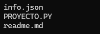

## PROYECTO FILTRO PYTHON

Cuenta con un archivo python y un json.

## Tabla De Contenido
| Índice | Título |Descripción|
|--|------|------|
| 1 | Proyecto| Plataforma|
| 2 | info | Info de campers , trainers y coordinador|

## Instalación

Deberas ejecutar el siguiente comando para clonar el repositorio y ver cada uno de los proyectos  desde tu maquina local:
 
Gith Bash

~~~ 
git clone  "link del repositorio" https://github.com/YurleyBG/proyecto_Luis_y_Yurley.git
~~~
al hacer esto se descargará  los datos del repositorio. puedes usar visual studio code para correr cada uno de los códigos en la terminal.
Recuerda tener instalado python en tu máquina local.

 ## Tecnología utilizadas

+ Python

## Estructura 

## Crédito 
Este  proyecto filtro fue desarrollado por Yurley Botello y Luis Miguel Caicedo.
